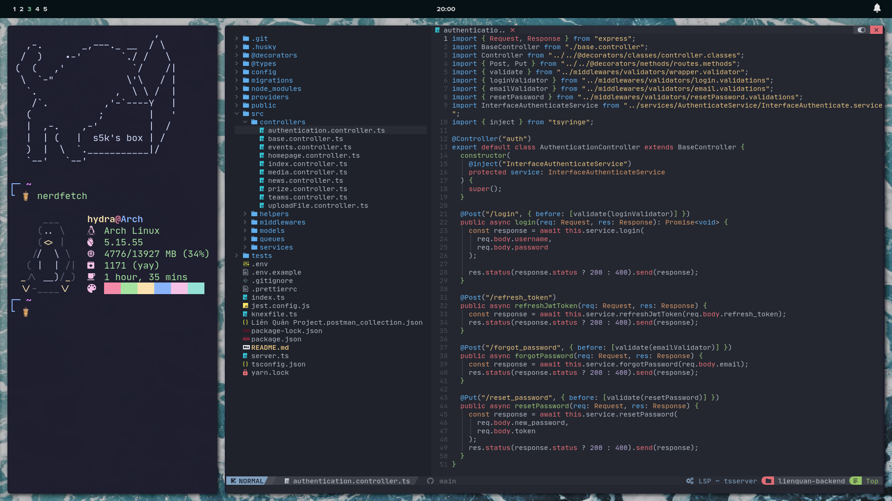
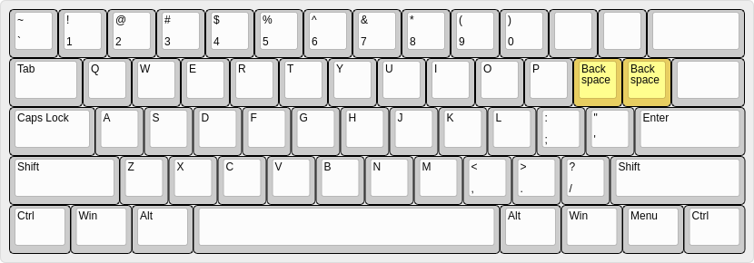
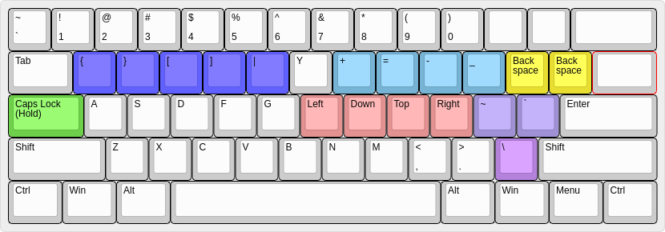

## Introduces

## Requirements

- Neovim 0.7
- Zsh & Oh my Zsh
- Kitty terminal

## The PinkyProtector
Script to prevent extensive usage of the right pinky finger by creating a different layer of keys (on any keyboard, by holding CapsLock). 

The custom layer is designed by me to have the special characters typed by the pinky spread across the right-hand keys. Also accounts for other utilitles (like arrow keys) to make using keyboard easier for your hand. 

In very early stages but will likely keep updating this script as I use it and find ways to make it better. Here's the layout

### VSCode Extensions
- Error lens
- GitHub Theme (Default theme)
- Vim
- Prettier

